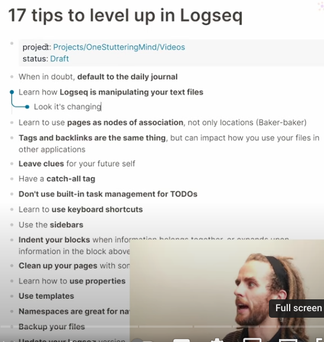

- housekeeping logseq #[[dioc of Hawai'i]] #logseq
	- I'm still having trouble getting dependable work on the HP device. I'm not sure if it's the version of logseq or git issues.
	- I cleaned out the duplicate files (seen on "re-index")
	- I'm somewhat confident that the pdf viewer doesn't work on the web version
- [[dioc of Hawai'i]] I'm saddened and emotional about getting the news that Dan Letterman has been defrocked for conduct unbecoming. I liked him. It comes close to home.
- 17 tips for logseq [youtube guide](https://youtu.be/Fnxq3iITAJk)
  collapsed:: true
	- 
- page links and tags
	- [explanation](https://discuss.logseq.com/t/the-difference-between-page-links-tags-and-properties/8393)
	- [discussion](https://discuss.logseq.com/t/the-difference-between-page-links-tags-and-properties/8393/2)
- Conversation with Peter Lane over lunch: #memories
- Remembering 
  
  Charles ... who wrote of the financial changes transforming the church
	- Will our children have faith ... (John Westerhoff)
	- I couldn't remember [[Francis Cambell Gray]]'s first name (Christ Gray brother on staff here.)
		- A survey on the web of his episcopate led to many memories from St. Andrew's
- [dioceses of IN and NoIN](https://scalar.usc.edu/works/episcopal-diocese-of-northern-indiana-archives/francis-campbell-gray-sixth-bishop)
  
  
  Peter related 
  friendship with former rector of Good Shepherd in Dunedin,