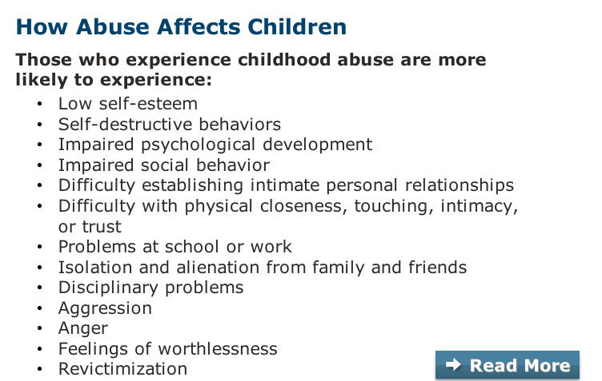
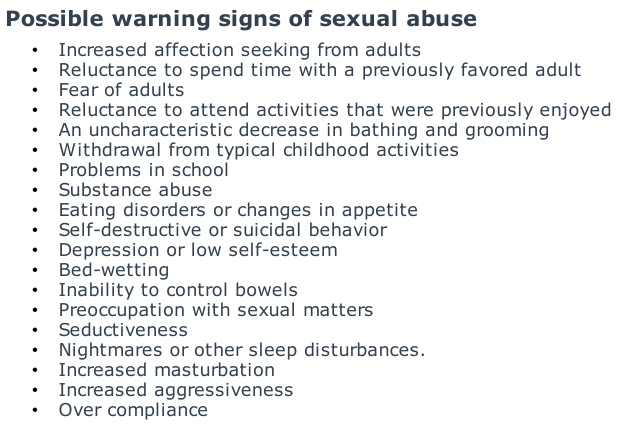

-
	- 30 page diocesan policies for the "Protection of Children and Youth from Abuse"
	  collapsed:: true
		- there is a form for reporting of **concern** about an inappropriate situation
		- p. 15 there is a checkmark system for agreeing to the poilicy, but my browser/system didn't work. Also a signature line.
	- Policy for the prevention of sexual exploitation of adults
	  collapsed:: true
		- all of this was written in deep **legalese**.
		- requirement to report (also law)
		- interview questions include giving examples of when my boundaries were crossed. Give an example of how someone maintains good boundaries with adults.
	- These 5 units need to be completed
		- **Diocese of Southwest Florida Policies**
		- **Keep your Church Safe**
		- **Promoting a Safe Environment: Employee Sexual Harassment Training**
		- **Promoting a Safe Environment: Supervisor Sexual Harassment Training**
		- **Duty to Report: Mandated Reporter**
- Course has an **action plan** to be used for
  collapsed:: true
	- Complete activities
	- store thoughts
	- retrieve information
- Keep church safe
	- screening
		- past behavior impo. therefore good to ask how they've handled things in the past
	- appropriate interactions
		- most offenders use same methods
	- monitoring
		- variety of ways to monitor
	- training
		- list of characteristics of those who experience childhood abuse
		  collapsed:: true
			- 
	- responding
		- **if you see something, say something**
		  collapsed:: true
			- 
		- 3 reasons people don't respond
		  collapsed:: true
			- worry about false accusation
			- don't believe an adult would actually abuse a child
			- don't know what will happen if they do report their concerns
		- responses to above:
			- prioritize the protection of the child
			- use anonymous reporting
			- know how reports are handled