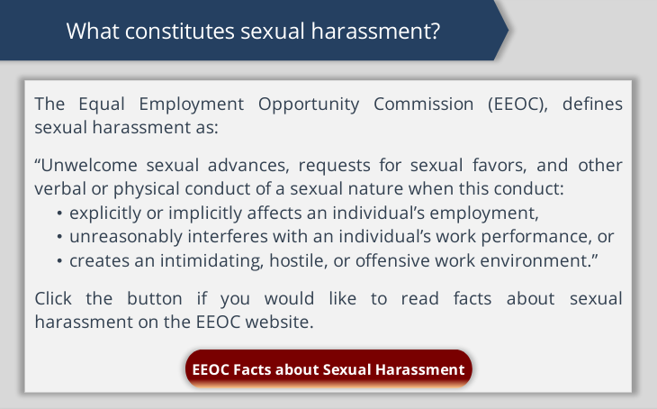
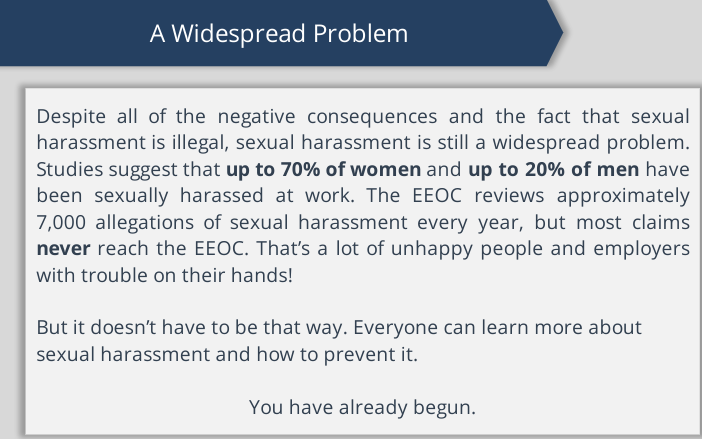
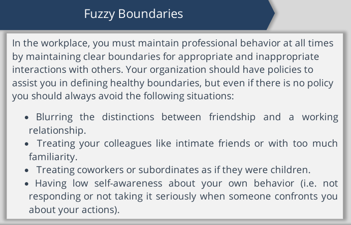
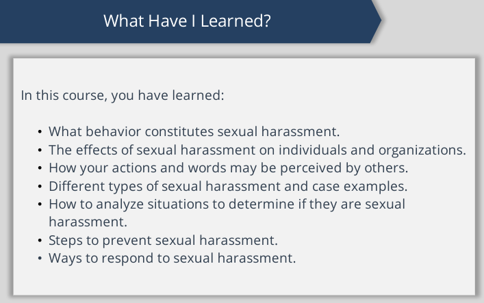

- [https://www.praesidiumacademy.com/learn/dashboard](https://www.praesidiumacademy.com/learn/dashboard)
	- 30 page diocesan policies for the "Protection of Children and Youth from Abuse"
	  collapsed:: true
		- there is a form for reporting of **concern** about an inappropriate situation
		- p. 15 there is a checkmark system for agreeing to the poilicy, but my browser/system didn't work. Also a signature line.
	- Policy for the prevention of sexual exploitation of adults
	  collapsed:: true
		- all of this was written in deep **legalese**.
		- requirement to report (also law)
		- interview questions include giving examples of when my boundaries were crossed. Give an example of how someone maintains good boundaries with adults.
	- These 5 units need to be completed
		- **Diocese of Southwest Florida Policies**
		- **Keep your Church Safe**
		- **Promoting a Safe Environment: Employee Sexual Harassment Training**
		- **Promoting a Safe Environment: Supervisor Sexual Harassment Training**
		- **Duty to Report: Mandated Reporter**
- Course has an **action plan** to be used for
  collapsed:: true
	- Complete activities
	- store thoughts
	- retrieve information
- Keep church safe
  collapsed:: true
	- screening
		- past behavior impo. therefore good to ask how they've handled things in the past
	- appropriate interactions
		- most offenders use same methods
	- monitoring
		- variety of ways to monitor
	- training
		- list of characteristics of those who experience childhood abuse
		  collapsed:: true
			- 
	- responding
		- **if you see something, say something**
		  collapsed:: true
			- 
		- 3 reasons people don't respond
		  collapsed:: true
			- worry about false accusation
			- don't believe an adult would actually abuse a child
			- don't know what will happen if they do report their concerns
		- responses to above:
			- prioritize the protection of the child
			- use anonymous reporting
			- know how reports are handled
- Sexual Harassment: Supervisor
  collapsed:: true
	- Overview
	  collapsed:: true
		- TItle VII of CIvil Rights Act 1964
		  collapsed:: true
			- collapsed:: true
			  > Unwelcome sexual advances, requests for sexual favors, and other 
			  verbal or physical conduct of a sexual nature constitute sexual 
			  harassment when this conduct explicitly or implicitly affects an 
			  individual's employment, unreasonably interferes
			  with an individual's work performance, or creates an intimidating, 
			  hostile, or offensive work environment.
			  
			  > Sexual harassment can occur in a variety of circumstances, including but not limited to the following:
				- The victim as well as the harasser may be a woman or a man. The victim does not have to be of the opposite sex.
				- The harasser can be the victim's supervisor, an agent of the 
				  employer, a supervisor in another area, a co-worker, or a non-employee.
				- The victim does not have to be the person harassed but could be anyone affected by the offensive conduct.
				- Unlawful sexual harassment may occur without economic injury to or discharge of the victim.
				- The harasser's conduct must be unwelcome.
	- Discrimination
	  collapsed:: true
		- also cf. discrimination in:
		  collapsed:: true
			- equal pay
			- age discrimination
			- disabilities
	- Harassment
		- in workplace:
			- quid pro quo
			- hostile work environment
			- tangible employment action
		- hostile work environment egs:
		  collapsed:: true
			- visual
			- verbal
			- physical
		- Reasonable person test -- rather than what a person's **intentions** were
		- Organizational liability if:
		  collapsed:: true
			- knowledge
			- lack of policies
			- no corrective action
		- abusive conduct
		- Retaliation
		- Preventing
		- Stopping
		- Responding: Report the complaint
		  collapsed:: true
			- Protect against retaliation
		- Accusations against supervisors
		  collapsed:: true
			- retaliation unacceptable
			- confidentiality maintained
		- resources & remedies
			-
		-
- Sexual Harassment: Employee
  collapsed:: true
	- Title VII: race, color, religion, sex, national origin, + added sexual orientation or gender identity.
	- definition
	  collapsed:: true
		- 
	- Effects
	  collapsed:: true
		- 
	- types:
		- quid pro quo
		- hostile work environment
		  collapsed:: true
			- 3 ways created
				- visual
				- verbal
				- physical
			- anyone can file a complaint, not just the victim
		- Varying perspectives
		  collapsed:: true
			- **reasonable person** test
		- types and cases
			- visual, verbal, physical
		- How can  you tell?
		  collapsed:: true
			- unwelcome behavior
			- negative impact
			- reasonable person
			- tests:
				- network news test
				- parent test
				- respect test
				- zero tolerance test
			- organizations clearly establish
				- interactions between employees
				- reporting: who to report to and how
				- leadership: what supervisors must do
				- **maintaining clear boundaries**
				  collapsed:: true
					- boundaries
					- 
		- steps to prevent
		- responding to sexual harassment
			- 3 steps
			  collapsed:: true
				- firmly & directly tell them to stop
				- document everything
				- report the harassment
			- barriers to reporting
			  collapsed:: true
				- fear of being ignored
				- fear of retaliation
				- fear of making accusations
			- steps for witness of harassment
			  collapsed:: true
				- discourage the behavior
				- report the harassment to employer
				- support the victim
			- steps if you think you harassed someone
			  collapsed:: true
				- stop the behavior immediately
				- tell supervisor
				- apologize to coworkers
				- review organizational policies
			- Most organizations require you to report -- or find trusted person
	- overview of course
		- 
		-
- Duty to report
	- Overview
	  collapsed:: true
		- why it is important
		- identify why people don't report
		- understand the moral and possibly legal requirement to report
	- reasons
	  collapsed:: true
		- prevent further harm
		- may save other children
		- contribute to safety of your community
		- bring policy and practice gaps to attention
		- avoid civil litigation & criminal charges
	- reasons people don't report
	  collapsed:: true
		- uncertainty
		- fear of reprisal
		- wrongly accusing
	- data
		- 1 in 4 girls & 1 in 6 boys are sexually abused before 18
	- Mandated reporter
		- Am I a **mandated reporter**? I don't know.
	- what must be reported
		- 4 categories
			- physical
			- sexual
			- psychological or emotional
			- neglect
-
-
-